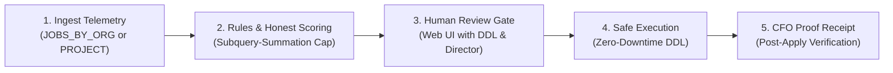

# 🚀 How to Run the BigQuery Optimization Control Plane on Your Dataset

This guide walks you step-by-step through running the **BigQuery Optimization Control Plane** (`bq-optimizer`) against **any of your own datasets** in Google Cloud BigQuery.

---

## 🧭 Table of Contents
1. [Overview & How It Works](#1-overview--how-it-works)
2. [🛡️ Zero-Risk Production Safety Guarantees](#2-️-zero-risk-production-safety-guarantees)
3. [⚡ Quick-Start (TL;DR Cheat Sheet)](#3--quick-start-tldr-cheat-sheet)
4. [Step 0: Prerequisites & Environment](#step-0-prerequisites--environment)
5. [Step 1: Configuration (Project, Dataset & Organization Scope)](#step-1-configuration-project-dataset--organization-scope)
6. [Step 2: Initialize the Control Plane (`init`)](#step-2-initialize-the-control-plane-init)
7. [Step 3: Collect Telemetry (`collect` — Project or Organization-Wide)](#step-3-collect-telemetry-collect--project-or-organization-wide)
8. [Step 4: Run the Rules Engine & Honest Scoring (`rules`)](#step-4-run-the-rules-engine--honest-scoring-rules)
9. [Step 5: Review Recommendations & Inspect DDL (Web UI or SQL)](#step-5-review-recommendations--inspect-ddl-web-ui-or-sql)
10. [Step 6: Executive & Director Spend Attribution (`v_spend_by_director`)](#step-6-executive--director-spend-attribution-v_spend_by_director)
11. [Step 7: Safe Execution with Guardrails (`execute`)](#step-7-safe-execution-with-guardrails-execute)
12. [Step 8: Verify Realized Savings & CFO Receipt (`verify`)](#step-8-verify-realized-savings--cfo-receipt-verify)
13. [Step 9: Safety Net & 1-Click Rollback (`rollback`)](#step-9-safety-net--1-click-rollback-rollback)
14. [💡 Troubleshooting & FAQs](#14--troubleshooting--faqs)

---

## 1. Overview & How It Works

The Optimization Control Plane identifies opportunities to **reduce BigQuery spend** and **speed up queries** by analyzing table structures and real query execution history.



### What It Optimizes:
* **Partitioning & Clustering**: Automatically recommends clustering columns on high-spend tables based on actual query `WHERE` and `JOIN` filters.
* **Storage Billing Model**: Compares Logical vs. Physical storage pricing for your dataset to recommend the cheaper billing model.
* **Partition Expiration**: Flags tables lacking partition lifecycle policies to prevent runaway storage bloat.
* **Query Anti-Patterns**: Detects expensive full scans (`SELECT *`), non-sargable filters (`WHERE DATE(ts) = ...`), and Cartesian joins.
* **Zombie Assets**: Identifies unused tables or abandoned scheduled queries.
* **Director & Team Attribution**: Maps all queries and recommendations to responsible Directors (e.g., Data Platform, Digital Ops) via employee hierarchy integration.

---

## 2. 🛡️ Zero-Risk Production Safety Guarantees

Running this on your production dataset is safe:

1. **🔒 Zero Payload Data Access**: The tool **never queries your table data rows**. It reads exclusively from BigQuery `INFORMATION_SCHEMA` (query metadata, table byte sizes, and column definitions).
2. **✋ Human-in-the-Loop Gate**: The tool **never applies changes automatically**. Every recommendation appears in a review queue with its full proposed BigQuery DDL. A human engineer must explicitly approve it.
3. **⚡ Zero Downtime (Class 1 DDL)**: Table clustering changes are applied in-place using BigQuery's native `ALTER TABLE ... SET OPTIONS (clustering_fields = [...])`. Tables remain 100% available for reads and writes throughout.
4. **💰 Honest Scoring**: We apply the **Subquery-Summation Cap**. A recommendation cannot claim more monthly savings than the total dollar amount actually spent on that table.
5. **⏪ 1-Click Rollback**: Any applied optimization can be rolled back instantly with a single command.

---

## 3. ⚡ Quick-Start (TL;DR Cheat Sheet)

If you already have your terminal open and authenticated, run these commands:

```bash
# 1. Initialize control plane dataset (one-time setup)
./run.sh init

# 2. Collect telemetry:
# Project-scoped:
./run.sh collect -d YOUR_DATASET_NAME
# OR Organization-wide (across all projects in GCP Org):
./run.sh collect --org

# 3. Analyze patterns and generate honest recommendations
./run.sh rules -d YOUR_DATASET_NAME

# 4. Open the visual review UI in your browser (shows exact DDL & Director)
./run.sh python3 review_app/main.py --port 8080
# Open http://localhost:8080 and click "Approve" on cards you want

# 5. Safely apply approved optimizations
./run.sh execute -d YOUR_DATASET_NAME

# 6. Verify post-apply query performance & CFO receipts
./run.sh verify
```

*(Note: `./run.sh` automatically routes to your Python virtual environment).*

---

## Step 0: Prerequisites & Environment

### 1. BigQuery Permissions
Make sure your Google Cloud identity has:
* `roles/bigquery.admin` **OR**
* `roles/bigquery.dataEditor` on the target dataset + `roles/bigquery.jobUser` on the project.
* For organization-wide telemetry: `roles/bigquery.resourceViewer` or `roles/bigquery.admin` at the GCP Organization or Folder level.

### 2. Verify Google Cloud Authentication
```bash
# Check current active project and account:
gcloud config get-value project
gcloud config get-value account

# If needed, authenticate Application Default Credentials (ADC):
gcloud auth application-default login
```

### 3. Verify Python Environment
The repo includes a configured virtual environment. Verify it:
```bash
./run.sh --help
```
If you see the help menu, your environment is ready!

---

## Step 1: Configuration (Project, Dataset & Organization Scope)

You can target your dataset and telemetry scope in two ways:

### Method A: Pass CLI Flags on the Fly (Recommended)
You do **not** need to edit any files. Just pass the flags:
```bash
# Single dataset in project:
./run.sh collect -d YOUR_DATASET_NAME
./run.sh rules -d YOUR_DATASET_NAME
./run.sh execute -d YOUR_DATASET_NAME

# All datasets in project:
./run.sh collect
./run.sh rules

# Organization-wide telemetry collection (all projects in GCP Org):
./run.sh collect --org
```

### Method B: Set Defaults in `config.yaml`
Edit [config.yaml](file:///usr/local/google/home/temiomisore/My-Jetski-Folder/Jetski-Drive-Folder/BQOpt-Optimization-Work/config.yaml):
```yaml
project_id: "your-gcp-project-id"
ops_dataset: "optimizer_ops"
location: "US"
regions: ["us"]

# Telemetry Scope:
# Set to JOBS_BY_ORGANIZATION to collect query telemetry across all projects in your GCP Org:
jobs_view: "JOBS_BY_ORGANIZATION"   # or "JOBS_BY_PROJECT"

# Employee Hierarchy Table:
employee_hierarchy_table: "optimizer_ops.employee_hierarchy"
```

> [!NOTE]
> **Understanding BigQuery's Telemetry Scopes**:
> BigQuery provides `region-{location}.INFORMATION_SCHEMA.JOBS_BY_ORGANIZATION` to view all query executions, bytes scanned, and slot reservations across every project in the GCP Organization.
> However, BigQuery does **not** provide `TABLES_BY_ORGANIZATION` or `TABLE_STORAGE_BY_ORGANIZATION`. Therefore, table storage metadata and column schemas are evaluated per project/dataset, while query workloads and Director-level spend can be captured across the entire enterprise!

---

## Step 2: Initialize the Control Plane (`init`)

Run this once per project:
```bash
./run.sh init
```

### What happens under the hood:
* Creates a dataset called `optimizer_ops` in your project (location defaults to `US`).
* Deploys state tables:
  * `jobs_events`: Stores normalized query execution history (project or org-wide).
  * `table_state_daily`: Snapshots table sizes, partition counts, and formats.
  * `employee_hierarchy`: Enterprise mapping of users to Directors and Departments.
  * `change_sets`: The audit state machine tracking all recommendations.
  * `v_pending_review`: View feeding the Review Web UI.
  * `v_spend_by_director`: Executive spend rollup by Director and Project.
  * `v_director_recommendations`: Recommendations mapped to Directors and impacted teams.
  * `v_receipts`: View showing verified savings receipts.

> **Note:** If `optimizer_ops` already exists, running `init` is completely idempotent and safe.

---

## Step 3: Collect Telemetry (`collect` — Project or Organization-Wide)

Extract metadata and recent query history:

```bash
# Option A: Collect query telemetry for your target dataset:
./run.sh collect -d YOUR_DATASET_NAME

# Option B: Collect organization-wide query telemetry across all GCP projects:
./run.sh collect --org
```

### What happens under the hood:
1. Queries `INFORMATION_SCHEMA.JOBS` (or `JOBS_BY_ORGANIZATION` when `--org` is active) for the query executions, bytes scanned, and slot milliseconds.
2. Snapshots table sizes and column data types from `INFORMATION_SCHEMA.TABLES` and `INFORMATION_SCHEMA.COLUMNS`.
3. Checks Cloud Storage / BigQuery billing models (Physical vs. Logical).

> [!TIP]
> **What if your dataset was just created or had no queries recently?**
> The rules engine needs query logs in `INFORMATION_SCHEMA.JOBS` to discover which columns are frequently filtered or joined. If your dataset has been idle, simply run 3 to 5 realistic analytical queries in BigQuery Studio touching your tables before running `collect`!

---

## Step 4: Run the Rules Engine & Honest Scoring (`rules`)

Analyze your dataset against 10+ cost-optimization patterns:
```bash
./run.sh rules -d YOUR_DATASET_NAME
```

### Output Example:
```
[*] Filtered rules to target dataset: YOUR_DATASET_NAME
expired=0 findings=3 inserted=3 suppressed=0
```

### What happens under the hood:
* **Evaluates Rules**:
  * `C1-01`: Detects unclustered tables that are frequently filtered in `WHERE` clauses.
  * `C1-02`: Compares Physical vs. Logical storage pricing to see if switching saves money.
  * `C1-03`: Checks for missing partition expiration policies on time-series tables.
  * `C4-01`: Flags queries scanning unnecessary columns (`SELECT *`).
  * `C4-03`: Flags non-sargable functions preventing partition pruning.
* **Calculates Honest Savings**: Capped by the actual 30-day dollar spend on each table.
* **Inserts Change Sets**: Recommendations are created in state `PENDING_REVIEW`.

---

## Step 5: Review Recommendations & Inspect DDL (Web UI or SQL)

Nothing has been executed yet. You now inspect the recommendations, review the proposed DDL and Director attribution, and decide what to approve.

### Option A: The Visual Web Review UI (Recommended)
Launch the lightweight review server:
```bash
./run.sh python3 review_app/main.py --port 8080
```
Open **`http://localhost:8080`** in your browser.

#### What Each Review Card Displays:
* **Target Table**: e.g., `temi-project-408005.temi_telco_demo.fact_network_events`
* **Recommended Action**: e.g., `REPARTITION (MONTH on event_start_timestamp)` or `SET_CLUSTERING`
* **Projected Monthly Savings**: Net dollar savings realized after factoring in write churn (e.g., `$30.00 / mo`)
* **Safety Class & Route**: `Class 1 (In-Place DDL, Zero Downtime)` or `Class 3 (Safe Zero-Copy Rebuild)`
* **👔 Owner / Director Badge**: e.g., `👔 Riley Chen (Director of Data Engineering) (Data Platform)`
* **Impacted Team & Query Volume**: e.g., `4 analysts running 145 queries`
* **⚡ Full Underlying BigQuery DDL / Execution SQL**:
  ```sql
  CREATE OR REPLACE TABLE `temi-project-408005.temi_telco_demo.fact_network_events`
  PARTITION BY TIMESTAMP_TRUNC(event_start_timestamp, MONTH)
  AS SELECT * FROM `temi-project-408005.temi_telco_demo.fact_network_events`;
  ```
  *(Engineers can copy this DDL directly or inspect its syntax before granting approval).*

#### 🚨 Blocked Guardrails Section (Halted Optimizations):
If an optimization is halted by pre-execution safety checks (e.g. streaming buffer active, potential regression, or schema conflict), the UI renders a prominent red card in the **🚨 BLOCKED BY SAFETY GUARDRAIL** section:
* **Blocker Message**: Explains exactly which safety guardrail halted execution.
* **⚡ Attempted BigQuery DDL / Execution SQL**: Displays the exact DDL that was attempted so engineers can immediately diagnose the failure.
* **Remediation**: Allows engineers to either `Snooze / Reject` the card with an audit reason, or `🔄 Reset to Review Queue` once underlying conditions are resolved.

Click **"Approve 👍"** on pending cards you want to queue for safe execution, or **"Reject 👎"** to dismiss them.

### Option B: Review & Approve via BigQuery SQL
You can also inspect the pending queue directly in BigQuery Studio:
```sql
SELECT 
  change_set_id,
  target_table,
  apply_class,
  rule_ids,
  gross_monthly_savings_usd,
  proposed_change_json
FROM `your-project.optimizer_ops.v_pending_review`
WHERE target_dataset = 'YOUR_DATASET_NAME';
```

To approve a card via SQL:
```sql
UPDATE `your-project.optimizer_ops.change_sets`
SET state = 'APPROVED',
    approved_by = SESSION_USER(),
    approved_at = CURRENT_TIMESTAMP()
WHERE change_set_id = 'YOUR_CHANGE_SET_ID';
```

---

## Step 6: Executive & Director Spend Attribution (`v_spend_by_director`)

The control plane joins query execution telemetry with your organizational hierarchy (`optimizer_ops.employee_hierarchy`), allowing FinOps and Engineering leadership to inspect spend and recommendations by business domain.

### 1. View BigQuery Spend Rolled Up by Director & Project:
```sql
SELECT 
  director_name,
  department,
  project_id,
  query_count,
  distinct_users,
  total_tb_scanned,
  total_query_spend_usd,
  total_slot_hours
FROM `your-project.optimizer_ops.v_spend_by_director`
ORDER BY total_query_spend_usd DESC;
```

### 2. View Active Recommendations Mapped to Directors & Teams:
```sql
SELECT 
  director_name,
  department,
  target_table,
  rule_ids,
  net_monthly_value_usd,
  confidence,
  impacted_users,
  queries_impacted
FROM `your-project.optimizer_ops.v_director_recommendations`
ORDER BY net_monthly_value_usd DESC;
```

---

## Step 7: Safe Execution with Guardrails (`execute`)

Apply only the recommendations that you explicitly approved:
```bash
./run.sh execute -d YOUR_DATASET_NAME
```

### What happens under the hood:
1. **Freezes Pre-Execution Baseline**: Captures average bytes scanned per query before applying the change.
2. **Applies In-Place DDL**: Executes `ALTER TABLE ... SET OPTIONS(...)` or the Class 3 zero-copy copy-swap-rebind machine.
   * Zero downtime for Class 1.
   * Atomic swap with zero copy data preservation for Class 3.
   * Future queries immediately begin benefiting from partition/clustering pruning.
3. **Transitions State**: Marks the change set as `APPLIED`, then moves it to `VERIFYING`.

---

## Step 8: Verify Realized Savings & CFO Receipt (`verify`)

Check that the optimization succeeded and didn't cause query regressions:
```bash
./run.sh verify
```

### Inspect the CFO Proof Receipt in BigQuery:
```sql
SELECT 
  change_set_id,
  target_dataset,
  target_table,
  predicted_usd,
  realized_usd,
  savings_basis,
  state,
  applied_at
FROM `your-project.optimizer_ops.v_receipts`
WHERE target_dataset = 'YOUR_DATASET_NAME';
```

* **Regression Watchdog**: If post-apply queries scan >15% more data than the baseline, the watchdog alerts and flags the change.
* **Proof Receipt**: Measures the reduction in bytes scanned to calculate realized dollar savings.

---

## Step 9: Safety Net & 1-Click Rollback (`rollback`)

If post-apply verification shows performance degradation or higher costs, you can roll back instantly via the CLI or directly in the Web UI:

```bash
# Rollback with post-mortem incident classification and 90-day anti-looping snooze
./run.sh rollback \
  --id YOUR_CHANGE_SET_ID \
  --category REGRESSION_PERFORMANCE \
  --reason "Queries scanning +22% more bytes after partitioning" \
  --snooze-days 90
```

### What Happens During Rollback:
* **Instant Restoration**:
  * **Class 1 (Clustering)**: Reverts the clustering options to the pre-apply definition.
  * **Class 3 (Structural Rebuild)**: Instantly restores the pre-change backup clone table as the primary table.
* **Forensics Table Preserved**: Rather than deleting the regressed table, it is safely renamed with a unique timestamp (`table__bqopt_regressed_YYYYMMDDHHMM`), preserving query traces and physical data blocks for post-mortem debugging.
* **90-Day Anti-Looping Snooze**: Sets `snooze_until = CURRENT_TIMESTAMP() + 90 days`. The compiler and rules engine automatically suppress this table from future recommendations during the snooze period, eliminating recurring duplicate proposals.
* **Post-Mortem Classification**: Categorizes the incident under one of 5 standard categories: `REGRESSION_PERFORMANCE`, `REGRESSION_COST`, `PIPELINE_BREAK`, `DATA_MISMATCH`, or `OTHER`.
* **Review UI Incident Audit**: The rolled-back change set moves to the dedicated **Incident Post-Mortem & Auto-Snooze Audit** banner at the bottom of the Web UI.
* **Human-in-the-Loop Re-evaluation**: Operators can inspect the forensics snapshot and click **`[ 🔓 Un-snooze & Re-evaluate in Queue ]`** anytime to release the snooze lock and return the recommendation to the review queue for refinement or explicit custom rejection.

---

## 10. 💡 Troubleshooting & FAQs

### Q: Why did `rules` return `findings=0`?
**A:** There are two common reasons:
1. **No recent query activity**: The collector inspects queries from the last 3 days (`INFORMATION_SCHEMA.JOBS`). If nobody has queried your dataset in that window, BigQuery has no query filters to analyze for clustering. Run 2-3 queries filtering on your dataset tables, re-run `./run.sh collect -d YOUR_DATASET`, and then re-run `./run.sh rules -d YOUR_DATASET`.
2. **Tables are already optimized**: If your tables are already well-partitioned, clustered, and on optimal storage models, the engine honestly reports 0 findings rather than suggesting unnecessary changes.

### Q: Can I run this across my entire project at once?
**A:** Yes! Simply omit the `-d` flag:
```bash
./run.sh collect
./run.sh rules
./run.sh execute
```
This will analyze and optimize every dataset in the configured project and region.

### Q: Can I collect query telemetry across my entire GCP Organization?
**A:** Yes! Pass the `--org` flag:
```bash
./run.sh collect --org
```
This pulls query logs from `region-{location}.INFORMATION_SCHEMA.JOBS_BY_ORGANIZATION` across all projects in the GCP Organization into `jobs_events`.

### Q: Will this disrupt ongoing queries or ETL pipelines?
**A:** No. Class 1 optimizations (clustering, storage billing models, partition expiration) use BigQuery native metadata updates with zero downtime. Existing queries and streaming pipelines continue running uninterrupted.

### Q: How does Rule `W-02` ("Proactive Cost Guardrail") stop a $5,000 ad-hoc query without failing our Service Accounts or ETL pipelines?
**A:** Rule `W-02` automatically inspects `user_email` in `optimizer_ops.jobs_events` (`INFORMATION_SCHEMA.JOBS`) and separates **Human Ad-Hoc Users** (`user_email NOT LIKE '%.gserviceaccount.com'`) from **Production Service Accounts & ETL Pipelines** (`*.iam.gserviceaccount.com`, `airflow`, `dbt`, `dataform`).
- **👤 Human Ad-Hoc Users**: Assigned a **50 GiB per-query safety cap (`SET @@maximum_bytes_billed = 53687091200`, max ~$0.31/query)** and an isolated **50-slot autoscaling sandbox (`human_adhoc_sandbox_pool`)** so an accidental `SELECT *` without a `WHERE` clause fails fast in 0ms before billing.
- **🤖 Service Accounts & Production ETL (`*.gserviceaccount.com`)**: Explicitly marked **100% EXEMPT** from query byte caps so nightly multi-terabyte ETL jobs never fail.

