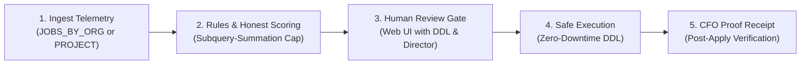

# 🚀 How to Run the BigQuery Optimization Control Plane on Your Dataset

This guide walks you step-by-step through running the **BigQuery Optimization Control Plane** (`bq-optimizer`) against **any of your own datasets** in Google Cloud BigQuery.

---

## 🧭 Table of Contents
1. [Overview & How It Works](#1-overview--how-it-works)
2. [🛡️ Zero-Risk Production Safety Guarantees](#2-️-zero-risk-production-safety-guarantees)
3. [⚡ Quick-Start (TL;DR Cheat Sheet)](#3--quick-start-tldr-cheat-sheet)
4. [Step 0: Prerequisites & Environment](#step-0-prerequisites--environment)
5. [Step 1: Configuration (Project, Dataset & Organization Scope)](#step-1-configuration-project-dataset--organization-scope)
6. [Step 2: Initialize the Control Plane (`init`)](#step-2-initialize-the-control-plane-init)
7. [Step 3: Collect Telemetry (`collect` — Project or Organization-Wide)](#step-3-collect-telemetry-collect--project-or-organization-wide)
8. [Step 4: Run the Rules Engine & Honest Scoring (`rules`)](#step-4-run-the-rules-engine--honest-scoring-rules)
9. [Step 5: Review Recommendations & Inspect DDL (Web UI or SQL)](#step-5-review-recommendations--inspect-ddl-web-ui-or-sql)
10. [Step 6: Executive & Director Spend Attribution (`v_spend_by_director`)](#step-6-executive--director-spend-attribution-v_spend_by_director)
11. [Step 7: Safe Execution with Guardrails (`execute`)](#step-7-safe-execution-with-guardrails-execute)
12. [Step 8: Verify Realized Savings & CFO Receipt (`verify`)](#step-8-verify-realized-savings--cfo-receipt-verify)
13. [Step 9: Safety Net & 1-Click Rollback (`rollback`)](#step-9-safety-net--1-click-rollback-rollback)
14. [💡 Troubleshooting & FAQs](#10--troubleshooting--faqs)

---

## 1. Overview & How It Works

The Optimization Control Plane identifies opportunities to **reduce BigQuery spend** and **speed up queries** by analyzing table structures and real query execution history.


```mermaid
graph LR
    A["1. Ingest Telemetry<br/>(JOBS_BY_ORG or PROJECT)"] --> B["2. Rules & Honest Scoring<br/>(Subquery-Summation Cap)"]
    B --> C["3. Human Review Gate<br/>(Web UI with DDL & Director)"]
    C --> D["4. Safe Execution<br/>(Zero-Downtime DDL)"]
    D --> E["5. CFO Proof Receipt<br/>(Post-Apply Verification)"]
```

### What It Optimizes:
* **Partitioning & Clustering**: Automatically recommends clustering columns on high-spend tables based on actual query `WHERE` and `JOIN` filters.
* **Storage Billing Model**: Compares Logical vs. Physical storage pricing for your dataset to recommend the cheaper billing model.
* **Partition Expiration**: Flags tables lacking partition lifecycle policies to prevent runaway storage bloat.
* **Query Anti-Patterns**: Detects expensive full scans (`SELECT *`), non-sargable filters (`WHERE DATE(ts) = ...`), and Cartesian joins.
* **Zombie Assets**: Identifies unused tables or abandoned scheduled queries.
* **Director & Team Attribution**: Maps all queries and recommendations to responsible Directors (e.g., Data Platform, Digital Ops) via employee hierarchy integration.

---

## 2. 🛡️ Zero-Risk Production Safety Guarantees

Running this on your production dataset is safe:

1. **🔒 Zero Payload Data Access**: The tool **never queries your table data rows**. It reads exclusively from BigQuery `INFORMATION_SCHEMA` (query metadata, table byte sizes, and column definitions).
2. **✋ Human-in-the-Loop Gate**: The tool **never applies changes automatically**. Every recommendation appears in a review queue with its full proposed BigQuery DDL. A human engineer must explicitly approve it.
3. **⚡ Zero Downtime (Class 1 DDL)**: Table clustering changes are applied in-place using BigQuery's native `ALTER TABLE ... SET OPTIONS (clustering_fields = [...])`. Tables remain 100% available for reads and writes throughout.
4. **💰 Honest Scoring**: Every card is priced the way its jobs are billed — on-demand jobs at bytes × $/TiB, reservation (Editions) jobs at slot-hours × the edition rate — and shows its formula. A recommendation cannot claim more than the money actually spent on that table, and the dashboard headline cannot exceed your last 30 days' actual compute spend (overlapping cards are compounded, never added).
5. **⏪ 1-Click Rollback**: Any applied optimization can be rolled back instantly with a single command.

---

## 3. ⚡ Quick-Start (TL;DR Cheat Sheet)

If you already have your terminal open and authenticated, run these commands:

```bash
# 1. Initialize control plane dataset (one-time setup)
./run.sh init

# 2. Collect telemetry:
# Project-scoped:
./run.sh collect -d YOUR_DATASET_NAME
# OR Organization-wide (across all projects in GCP Org):
./run.sh collect --org

# 3. Analyze patterns and generate honest recommendations
./run.sh rules -d YOUR_DATASET_NAME

# 4. Open the visual review UI in your browser (shows exact DDL & Director)
./run.sh python3 review_app/main.py --port 8080
# Open http://localhost:8080 and click "Approve" on cards you want

# 5. Safely apply approved optimizations
./run.sh execute -d YOUR_DATASET_NAME

# 6. Verify post-apply query performance & CFO receipts
./run.sh verify
```

*(Note: `./run.sh` automatically routes to your Python virtual environment).*

---

## Step 0: Prerequisites & Environment

### 1. BigQuery Permissions
Make sure your Google Cloud identity has:
* `roles/bigquery.admin` **OR**
* `roles/bigquery.dataEditor` on the target dataset + `roles/bigquery.jobUser` on the project.
* For organization-wide telemetry: `roles/bigquery.resourceViewer` or `roles/bigquery.admin` at the GCP Organization or Folder level.

### 2. Verify Google Cloud Authentication
```bash
# Check current active project and account:
gcloud config get-value project
gcloud config get-value account

# If needed, authenticate Application Default Credentials (ADC):
gcloud auth application-default login
```

### 3. Verify Python Environment
The repo includes a configured virtual environment. Verify it:
```bash
./run.sh --help
```
If you see the help menu, your environment is ready!

---

## Step 1: Configuration (Project, Dataset & Organization Scope)

You can target your dataset and telemetry scope in two ways:

### Method A: Pass CLI Flags on the Fly (Recommended)
You do **not** need to edit any files. Just pass the flags:
```bash
# Single dataset in project:
./run.sh collect -d YOUR_DATASET_NAME
./run.sh rules -d YOUR_DATASET_NAME
./run.sh execute -d YOUR_DATASET_NAME

# All datasets in project:
./run.sh collect
./run.sh rules

# Organization-wide telemetry collection (all projects in GCP Org):
./run.sh collect --org
```

### Method B: Set Defaults in `config.yaml`
Edit [config.yaml](file:///usr/local/google/home/temiomisore/My-Jetski-Folder/Jetski-Drive-Folder/BQOpt-Optimization-Work/config.yaml):
```yaml
project_id: "your-gcp-project-id"
ops_dataset: "optimizer_ops"
location: "US"
regions: ["us"]

# Telemetry Scope:
# Set to JOBS_BY_ORGANIZATION to collect query telemetry across all projects in your GCP Org:
jobs_view: "JOBS_BY_ORGANIZATION"   # or "JOBS_BY_PROJECT"

# Employee Hierarchy Table:
employee_hierarchy_table: "optimizer_ops.employee_hierarchy"

# Reservation admin project: reservation jobs are priced at their reservation's
# edition slot rate, read from here (Enterprise list price if left null).
reservation_admin_project: "your-reservation-admin-project"

# Service account -> accountable human owner (PowerBI, ETL ...). Map YOUR column names:
service_account_owner_table: "gov-project.iam.sa_owner_map"
service_account_owner_columns:
  service_account: sa_email        # required
  owner: owner_email               # required
  owner_team: team                 # optional
  director_email: director_email   # optional (else taken from the owner's hierarchy row)
  director_name: director_name     # optional
  application: app_name            # optional

# Savings math
demo_mode: false                   # never true for a real customer
pricing:
  reservation_savings_realization: 1.0   # lower (e.g. 0.3) if most slots are committed baseline

# FinOps / governance: who may see and approve billing, commitment,
# reservation and project-level cards (everyone else gets HTTP 403)
governance:
  finops_approvers: ["finops-lead@yourco.com", "data-platform-director@yourco.com"]
  trust_client_identity: false     # keep false outside demos
  iap_audience: "/projects/PROJECT_NUMBER/locations/REGION/services/SERVICE_NAME"
```

> [!IMPORTANT]
> `finops_approvers` empty means **nobody** can approve FinOps cards (fail closed). You can add approvers without editing the file via the env var `BQOPT_FINOPS_APPROVERS` (comma-separated). The review app only trusts the email inside a **verified IAP JWT**; put the app behind IAP and set `iap_audience`.

> [!NOTE]
> **Understanding BigQuery's Telemetry Scopes**:
> BigQuery provides `region-{location}.INFORMATION_SCHEMA.JOBS_BY_ORGANIZATION` to view all query executions, bytes scanned, and slot reservations across every project in the GCP Organization.
> However, BigQuery does **not** provide `TABLES_BY_ORGANIZATION` or `TABLE_STORAGE_BY_ORGANIZATION`. Therefore, table storage metadata and column schemas are evaluated per project/dataset, while query workloads and Director-level spend can be captured across the entire enterprise!

---

## Step 2: Initialize the Control Plane (`init`)

Run this once per project:
```bash
./run.sh init
```

### What happens under the hood:
* Creates a dataset called `optimizer_ops` in your project (location defaults to `US`).
* Deploys state tables:
  * `jobs_events`: Stores normalized query execution history (project or org-wide).
  * `table_state_daily`: Snapshots table sizes, partition counts, and formats.
  * `employee_hierarchy`: Enterprise mapping of users to Directors and Departments.
  * `service_account_owners`: Service account → accountable human owner (used when `service_account_owner_table` is not set).
  * `change_sets`: The audit state machine tracking all recommendations.
  * `v_jobs_costed`: Every job priced the way it was billed (`billing_mode`, `est_cost_usd`).
  * `v_pending_review`: View feeding the Review Web UI.
  * `v_spend_by_director`: Executive spend rollup by Director and Project (service-account spend rolls up to its owner's Director).
  * `v_unmapped_service_accounts`: Service accounts with spend but no owner — the to-do list for the mapping table.
  * `v_director_recommendations`: Recommendations mapped to Directors and impacted teams.
  * `v_receipts`: View showing verified savings receipts.
* Points the attribution views at your own hierarchy / service-account tables when they are configured (column names mapped from `config.yaml`). `init` stops with a clear error if a required column mapping is missing.

> **Note:** If `optimizer_ops` already exists, running `init` is completely idempotent and safe. Re-run it after upgrading the tool or changing the attribution tables — `rules` refuses to run on views that predate billing-aware pricing.

---

## Step 3: Collect Telemetry (`collect` — Project or Organization-Wide)

Extract metadata and recent query history:

```bash
# Option A: Collect query telemetry for your target dataset:
./run.sh collect -d YOUR_DATASET_NAME

# Option B: Collect organization-wide query telemetry across all GCP projects:
./run.sh collect --org
```

### What happens under the hood:
1. Queries `INFORMATION_SCHEMA.JOBS` (or `JOBS_BY_ORGANIZATION` when `--org` is active) for the query executions, bytes scanned, and slot milliseconds.
2. Snapshots table sizes and column data types from `INFORMATION_SCHEMA.TABLES` and `INFORMATION_SCHEMA.COLUMNS`.
3. Checks Cloud Storage / BigQuery billing models (Physical vs. Logical).

> [!TIP]
> **What if your dataset was just created or had no queries recently?**
> The rules engine needs query logs in `INFORMATION_SCHEMA.JOBS` to discover which columns are frequently filtered or joined. If your dataset has been idle, simply run 3 to 5 realistic analytical queries in BigQuery Studio touching your tables before running `collect`!

---

## Step 4: Run the Rules Engine & Honest Scoring (`rules`)

Analyze your dataset against 10+ cost-optimization patterns:
```bash
./run.sh rules -d YOUR_DATASET_NAME
```

### Output Example:
```
[*] Filtered rules to target dataset: YOUR_DATASET_NAME
expired=0 findings=3 inserted=3 suppressed=0 refreshed=2 retired=1
```

### What happens under the hood:
* **Evaluates Rules**:
  * `C1-01`: Detects unclustered tables that are frequently filtered in `WHERE` clauses.
  * `C1-02`: Enforces `require_partition_filter` where every observed query already filters.
  * `C1-03`: Sets default expirations on staging/scratch datasets.
  * `C4-01`: Flags queries scanning unnecessary columns (`SELECT *`).
  * `C4-03`: Flags non-sargable functions preventing partition pruning.
* **Calculates Honest, Billing-Aware Savings**: on-demand spend at bytes × $/TiB, reservation spend at slot-hours × edition rate (scaled by `pricing.reservation_savings_realization`), split across the tables a job reads, and capped by the actual spend. Each card records its formula under `evidence.savings_math`.
* **Keeps the queue current**: unapproved cards that are detected again are re-priced in place (`refreshed`); unapproved cards priced the old way that no longer hold up are retired as `SUPERSEDED` (`retired`).
* **Inserts Change Sets**: New recommendations are created in state `PENDING_REVIEW`.

---

## Step 5: Review Recommendations & Inspect DDL (Web UI or SQL)

Nothing has been executed yet. You now inspect the recommendations, review the proposed DDL and Director attribution, and decide what to approve.

### Option A: The Visual Web Review UI (Recommended)
Launch the lightweight review server:
```bash
./run.sh python3 review_app/main.py --port 8080
```
Open **`http://localhost:8080`** in your browser.

#### What Each Review Card Displays:
* **Target Table**: e.g., `temi-project-408005.temi_telco_demo.fact_network_events`
* **Recommended Action**: e.g., `REPARTITION (MONTH on event_start_timestamp)` or `SET_CLUSTERING`
* **Projected Monthly Savings**: Net dollar savings realized after factoring in write churn (e.g., `$30.00 / mo`)
* **Safety Class & Route**: `Class 1 (In-Place DDL, Zero Downtime)` or `Class 3 (Safe Zero-Copy Rebuild)`
* **👔 Owner / Director Badge**: e.g., `👔 Riley Chen (Director of Data Engineering) (Data Platform)`
* **Impacted Team & Query Volume**: e.g., `4 analysts running 145 queries`
* **⚡ Full Underlying BigQuery DDL / Execution SQL**:
  ```sql
  CREATE OR REPLACE TABLE `temi-project-408005.temi_telco_demo.fact_network_events`
  PARTITION BY TIMESTAMP_TRUNC(event_start_timestamp, MONTH)
  AS SELECT * FROM `temi-project-408005.temi_telco_demo.fact_network_events`;
  ```
  *(Engineers can copy this DDL directly or inspect its syntax before granting approval).*

#### 🚨 Blocked Guardrails Section (Halted Optimizations):
If an optimization is halted by pre-execution safety checks (e.g. streaming buffer active, potential regression, or schema conflict), the UI renders a prominent red card in the **🚨 BLOCKED BY SAFETY GUARDRAIL** section:
* **Blocker Message**: Explains exactly which safety guardrail halted execution.
* **⚡ Attempted BigQuery DDL / Execution SQL**: Displays the exact DDL that was attempted so engineers can immediately diagnose the failure.
* **Remediation**: Allows engineers to either `Snooze / Reject` the card with an audit reason, or `🔄 Reset to Review Queue` once underlying conditions are resolved.

Click **"Approve 👍"** on pending cards you want to queue for safe execution, or **"Reject 👎"** to dismiss them.

#### 💳 FinOps & Billing Tab (privileged viewers only)
Billing, commitment, reservation and project-level cards (`W-01` Editions sizing, `W-02` human cost guardrail, `C1-05` storage billing model, reservation tuning) live in a separate **FinOps & billing** tab:
* Only identities in `governance.finops_approvers` (or `BQOPT_FINOPS_APPROVERS`) receive these cards, the W-01 billing panel and the org-wide spend figure. Everyone else sees the engineering queue only, with KPIs computed on what they can see.
* The check runs on the server: approving, rejecting or resetting a FinOps card as anyone else returns **HTTP 403** with `"code": "FINOPS_PERMISSION_REQUIRED"`.
* `execute` re-checks the approvals and sends a card back to `PENDING_REVIEW` if a non-FinOps approval slipped in.

#### 💰 Reading the Savings Headline
* **Net monthly savings** never double counts: cards on the same table, query or dataset compound (50% + 50% = 75%), a single-table query rewrite joins its table's cards, Editions/byte-cap cards only count against what the table and query fixes leave, and the total is capped at the last 30 days' actual compute spend. The plain sum of the cards is shown next to it.
* Open any card's **"How this saving is calculated"** panel to see its inputs, billing mix (on-demand vs reservation) and formula.
* A **legacy estimate** badge marks a card priced before billing-aware math; the next `rules` run re-prices or retires it.

### Option B: Review & Approve via BigQuery SQL
You can also inspect the pending queue directly in BigQuery Studio:
```sql
SELECT 
  change_set_id,
  target_table,
  apply_class,
  rule_ids,
  gross_monthly_savings_usd,
  proposed_change_json
FROM `your-project.optimizer_ops.v_pending_review`
WHERE target_dataset = 'YOUR_DATASET_NAME';
```

To approve a card via SQL:
```sql
UPDATE `your-project.optimizer_ops.change_sets`
SET state = 'APPROVED',
    approved_by = SESSION_USER(),
    approved_at = CURRENT_TIMESTAMP()
WHERE change_set_id = 'YOUR_CHANGE_SET_ID';
```

---

## Step 6: Executive & Director Spend Attribution (`v_spend_by_director`)

The control plane joins query execution telemetry with your organizational hierarchy (`optimizer_ops.employee_hierarchy` or your own table) and your service-account → owner table, so FinOps and Engineering leadership can inspect spend and recommendations by business domain. Service-account spend (PowerBI, ETL ...) rolls up **service account → owner → owner's Director**.

### 1. View BigQuery Spend Rolled Up by Director & Project:
```sql
SELECT
  director_name,
  department,
  project_id,
  total_queries,
  active_users,
  total_billed_tb,
  estimated_spend_usd,        -- billing-aware (on-demand bytes + reservation slot-hours)
  on_demand_spend_usd,
  reservation_spend_usd,
  total_slot_hours,
  attribution_sources         -- e.g. EMPLOYEE_HIERARCHY+SERVICE_ACCOUNT_OWNER
FROM `your-project.optimizer_ops.v_spend_by_director`
ORDER BY estimated_spend_usd DESC;
```

### 2. View Active Recommendations Mapped to Directors & Teams:
```sql
SELECT
  director_name,
  department,
  target_table,
  rule_ids,
  gross_monthly_savings_usd,
  team_readers_count,
  team_queries_count,
  attribution_source
FROM `your-project.optimizer_ops.v_director_recommendations`
ORDER BY gross_monthly_savings_usd DESC;
```

### 3. Find Service Accounts That Still Need an Owner:
```sql
SELECT service_account_email, mapping_status, queries_90d, est_spend_usd_90d, projects, last_seen_at
FROM `your-project.optimizer_ops.v_unmapped_service_accounts`
ORDER BY est_spend_usd_90d DESC;
```
Add the top rows to your mapping table (or `optimizer_ops.service_account_owners`); the next dashboard load picks them up. Cards for queries run by an unmapped service account carry the risk note `QUERY_RUN_BY_UNMAPPED_SERVICE_ACCOUNT`.

> [!NOTE]
> When `service_account_owner_table` / `employee_hierarchy_table` point at tables in another project, grant the review app's and collector's service accounts **BigQuery Data Viewer** on them, then re-run `init`.

---

## Step 7: Safe Execution with Guardrails (`execute`)

Apply only the recommendations that you explicitly approved:
```bash
./run.sh execute -d YOUR_DATASET_NAME
```

### What happens under the hood:
1. **Freezes Pre-Execution Baseline**: Captures average bytes scanned per query before applying the change.
2. **Applies In-Place DDL**: Executes `ALTER TABLE ... SET OPTIONS(...)` or the Class 3 zero-copy copy-swap-rebind machine.
   * Zero downtime for Class 1.
   * Atomic swap with zero copy data preservation for Class 3.
   * Future queries immediately begin benefiting from partition/clustering pruning.
3. **Transitions State**: Marks the change set as `APPLIED`, then moves it to `VERIFYING`.

---

## Step 8: Verify Realized Savings & CFO Receipt (`verify`)

Check that the optimization succeeded and didn't cause query regressions:
```bash
./run.sh verify
```

### Inspect the CFO Proof Receipt in BigQuery:
```sql
SELECT 
  change_set_id,
  target_dataset,
  target_table,
  predicted_usd,
  realized_usd,
  savings_basis,
  state,
  applied_at
FROM `your-project.optimizer_ops.v_receipts`
WHERE target_dataset = 'YOUR_DATASET_NAME';
```

* **Regression Watchdog**: If post-apply queries scan >15% more data than the baseline, the watchdog alerts and flags the change.
* **Proof Receipt**: Measures the reduction in bytes scanned to calculate realized dollar savings.

---

## Step 9: Safety Net & 1-Click Rollback (`rollback`)

If post-apply verification shows performance degradation or higher costs, you can roll back instantly via the CLI or directly in the Web UI:

```bash
# Rollback with post-mortem incident classification and 90-day anti-looping snooze
./run.sh rollback \
  --id YOUR_CHANGE_SET_ID \
  --category REGRESSION_PERFORMANCE \
  --reason "Queries scanning +22% more bytes after partitioning" \
  --snooze-days 90
```

### What Happens During Rollback:
* **Instant Restoration**:
  * **Class 1 (Clustering)**: Reverts the clustering options to the pre-apply definition.
  * **Class 3 (Structural Rebuild)**: Instantly restores the pre-change backup clone table as the primary table.
* **Forensics Table Preserved**: Rather than deleting the regressed table, it is safely renamed with a unique timestamp (`table__bqopt_regressed_YYYYMMDDHHMM`), preserving query traces and physical data blocks for post-mortem debugging.
* **90-Day Anti-Looping Snooze**: Sets `snooze_until = CURRENT_TIMESTAMP() + 90 days`. The compiler and rules engine automatically suppress this table from future recommendations during the snooze period, eliminating recurring duplicate proposals.
* **Post-Mortem Classification**: Categorizes the incident under one of 5 standard categories: `REGRESSION_PERFORMANCE`, `REGRESSION_COST`, `PIPELINE_BREAK`, `DATA_MISMATCH`, or `OTHER`.
* **Review UI Incident Audit**: The rolled-back change set moves to the dedicated **Incident Post-Mortem & Auto-Snooze Audit** banner at the bottom of the Web UI.
* **Human-in-the-Loop Re-evaluation**: Operators can inspect the forensics snapshot and click **`[ 🔓 Un-snooze & Re-evaluate in Queue ]`** anytime to release the snooze lock and return the recommendation to the review queue for refinement or explicit custom rejection.

---

## 10. 💡 Troubleshooting & FAQs

### Q: Why did `rules` return `findings=0`?
**A:** There are two common reasons:
1. **No recent query activity**: The collector inspects queries from the last 3 days (`INFORMATION_SCHEMA.JOBS`). If nobody has queried your dataset in that window, BigQuery has no query filters to analyze for clustering. Run 2-3 queries filtering on your dataset tables, re-run `./run.sh collect -d YOUR_DATASET`, and then re-run `./run.sh rules -d YOUR_DATASET`.
2. **Tables are already optimized**: If your tables are already well-partitioned, clustered, and on optimal storage models, the engine honestly reports 0 findings rather than suggesting unnecessary changes.

### Q: Can I run this across my entire project at once?
**A:** Yes! Simply omit the `-d` flag:
```bash
./run.sh collect
./run.sh rules
./run.sh execute
```
This will analyze and optimize every dataset in the configured project and region.

### Q: Can I collect query telemetry across my entire GCP Organization?
**A:** Yes! Pass the `--org` flag:
```bash
./run.sh collect --org
```
This pulls query logs from `region-{location}.INFORMATION_SCHEMA.JOBS_BY_ORGANIZATION` across all projects in the GCP Organization into `jobs_events`.

### Q: Will this disrupt ongoing queries or ETL pipelines?
**A:** No. Class 1 optimizations (clustering, storage billing models, partition expiration) use BigQuery native metadata updates with zero downtime. Existing queries and streaming pipelines continue running uninterrupted.

### Q: How does Rule `W-02` ("Proactive Cost Guardrail") stop a $5,000 ad-hoc query without failing our Service Accounts or ETL pipelines?
**A:** Rule `W-02` automatically inspects `user_email` in `optimizer_ops.jobs_events` (`INFORMATION_SCHEMA.JOBS`) and separates **Human Ad-Hoc Users** (`user_email NOT LIKE '%.gserviceaccount.com'`) from **Production Service Accounts & ETL Pipelines** (`*.iam.gserviceaccount.com`, `airflow`, `dbt`, `dataform`).
- **👤 Human Ad-Hoc Users**: Assigned a **50 GiB per-query safety cap (`SET @@maximum_bytes_billed = 53687091200`, max ~$0.31/query)** and an isolated **50-slot autoscaling sandbox (`human-adhoc-sandbox-pool`)** so an accidental `SELECT *` without a `WHERE` clause fails fast in 0ms before billing.
- **🤖 Service Accounts & Production ETL (`*.gserviceaccount.com`)**: Explicitly marked **100% EXEMPT** from query byte caps so nightly multi-terabyte ETL jobs never fail.


### Q: Why is the savings headline lower than the sum of the cards?
**A:** Because several cards often chase the same dollars. The headline:
1. compounds cards on the same table, query or dataset (two 50% cuts on one table save 75%, not 100%);
2. lets a rewrite of a single-table query join that table's cards;
3. counts Editions sizing (`W-01`) and the human byte cap (`W-02`) only against the spend the table and query fixes leave behind;
4. caps compute savings at the last 30 days' actual compute spend (`v_jobs_costed`).

When step 4 kicks in, the KPI tile says **"capped at actual 30-day compute spend ($X)"**. The plain sum of the cards stays visible for comparison.

### Q: Why did a card's price change, or why did it become `SUPERSEDED`, after `rules`?
**A:** Each `rules` run re-prices every card that is still waiting for its first approval, using that day's telemetry and billing-aware math (`refreshed=` in the output). Unapproved cards priced by the older, non-billing-aware math are re-priced from the query's current cost, or retired as `SUPERSEDED` when the finding no longer shows up or can't be re-priced (`retired=`). Retired findings come back with billing-aware numbers if they still apply. Cards that already have an approval are never re-priced; the card history records why each one changed.

### Q: Why do I get HTTP 403 `FINOPS_PERMISSION_REQUIRED`?
**A:** The card is a billing, commitment, reservation or project-level card, and your identity is not in `governance.finops_approvers` (or `BQOPT_FINOPS_APPROVERS`). Ask a FinOps approver to act on it, or have one added to the list. Only verified identities count: put the review app behind IAP and set `governance.iap_audience`. If the list is empty, nobody can approve FinOps cards (fail closed). `trust_client_identity: true` is for the sandbox persona picker only.

### Q: What does `SLOT_TELEMETRY_IMPLAUSIBLE_FOR_BYTES_SCANNED` mean on the `W-01` card?
**A:** The project's job history shows far more bytes scanned than its recorded slot usage could process (under 0.5 slot-hours per TiB). This usually means synthetic or imported jobs, or gaps in `JOBS_TIMELINE`. The card stays in the queue with low confidence (0.4) and a warning in its formula. Check the slot telemetry before acting on it.

### Q: Why did the `W-01` (Editions) card disappear?
**A:** `W-01` prices Editions autoscaling the way BigQuery bills it: 50-slot steps with a 1-minute minimum. Spiky workloads can be billed many times their measured slot-hours. When neither Editions option beats your current bill, the rule creates no card instead of claiming a saving.
