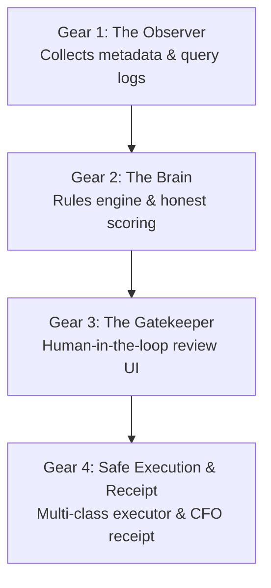

# 📘 BigQuery Optimization Control Plane: Step-by-Step Master Guide
## *From Step Zero to the Finish Line (Using `<YOUR_PROJECT_ID>.customer360_telco`)*

---

## 🧭 Table of Contents
1. [Executive Summary: How to Explain This in 60 Seconds](#1-executive-summary-how-to-explain-this-in-60-seconds)
2. [The 4 Core Gears (The Mental Model)](#2-the-4-core-gears-the-mental-model)
3. [Step 0: Prerequisites & Project Configuration](#step-0-prerequisites--project-configuration)
4. [Step 1: Initialize the Control Plane (`optimizer_ops`)](#step-1-initialize-the-control-plane-optimizer_ops)
5. [Step 2: Collect Telemetry & Query Metadata](#step-2-collect-telemetry--query-metadata)
6. [Step 3: Run the Rules Engine & Honest Scoring](#step-3-run-the-rules-engine--honest-scoring)
7. [Step 4: The Human-in-the-Loop Review Gate](#step-4-the-human-in-the-loop-review-gate)
8. [Step 5: Safe Execution with Production Guardrails](#step-5-safe-execution-with-production-guardrails)
9. [Step 6: Verify Realized Savings (The CFO Receipt)](#step-6-verify-realized-savings-the-cfo-receipt)
10. [Step 7: Rollback & Disaster Recovery](#step-7-rollback--disaster-recovery)
11. [Customer Production Rollout & Day-2 Automation](#11-customer-production-rollout--day-2-automation)

---

## 1. Executive Summary: How to Explain This in 60 Seconds

### The Problem in Every Enterprise:
> *"Every enterprise running BigQuery wants to reduce costs and speed up dashboards. Google Cloud provides Active Assist recommendations, but data engineering teams **rarely apply them in production**. Why? Because engineers are afraid of breaking Looker dashboards, dropping Row-Level Security (RLS) policies, or causing pipeline downtime."*

### What This Tool Does:
> *"The **BigQuery Optimization Control Plane** (`bq-optimizer`) is a production safety layer. It analyzes query logs, calculates honest dollar savings, gives engineers a 1-click web interface to review changes, executes updates with zero-downtime safety guardrails, and produces a verified ROI proof receipt for the CFO."*

---

## 2. The 4 Core Gears (The Mental Model)



1. **Gear 1: The Observer (Collector)**: Reads BigQuery `INFORMATION_SCHEMA` and Active Assist. It **never reads customer payload data**—only query metadata, scan volumes, and execution times.
2. **Gear 2: The Brain (Rules Engine & Scoring)**: Evaluates 10+ optimization patterns (clustering, partitioning, unused table archiving, query anti-patterns) and calculates capped dollar savings.
3. **Gear 3: The Gatekeeper (Human Review UI)**: Formats recommendations as clear cards showing proposed SQL, risk ratings, and estimated savings. A human engineer must click **"Approve 👍"** before anything executes.
4. **Gear 4: The Executioner & Verifier**:
   - **Class 1 (Metadata)**: In-place `ALTER TABLE` DDL (0 downtime).
   - **Class 2 (Additive)**: Materialized Views with automated spend watchdogs.
   - **Class 3 (Table Rebuild)**: 10-stage Copy-Swap-Rebind with checksum validation and RLS preservation.
   - **Class 4 (Query Rewrite)**: Pull Request diffs for dbt models / Looker views.
   - **Verifier**: Measures post-change query scans vs. pre-change baseline and writes a CFO receipt.

---

## 3. Step 0: Prerequisites & Project Configuration

### Customer Environment Check:
- **Project ID**: `<YOUR_PROJECT_ID>`
- **Target Dataset**: `customer360_telco`
- **Tables Present**:
  - `dim_customer` (20,000 rows, 80+ wide columns, unpartitioned, unclustered)
  - `dim_location`, `dim_equipment`, `dim_product`
  - `fact_network_events` (1,307 rows)
  - `fact_subscriptions` (34,285 rows)
  - `potential_churn_customers` (51 rows)

### Configuration Options (Config File vs. CLI Parameters):
You have two flexible options to specify your target project and dataset:

#### Option A: Set defaults in `config.yaml`
```yaml
project_id: "<YOUR_PROJECT_ID>"
location: "US"
ops_dataset: "optimizer_ops"
dry_run: false

pricing:
  on_demand_per_tb: 6.25
  storage_active_logical_gb: 0.02
  storage_active_physical_gb: 0.04
```

#### Option B: Pass dynamic CLI parameters on the fly (No YAML editing needed!)
You can pass flags directly to any CLI command to target specific projects, datasets, or locations:
```bash
# Target a specific dataset directly via -d / --dataset:
python -m optimizer.cli rules --dataset customer360_telco
python -m optimizer.cli execute --dataset customer360_telco

# Target another project directly via -p / --project:
python -m optimizer.cli init -p another-customer-project-id
python -m optimizer.cli rules -p another-customer-project-id -d analytics_mart

# Point to a custom config file via -c / --config:
python -m optimizer.cli rules --config /path/to/client_config.yaml
```

> **Note:** By default, if no `--dataset` is specified, `bq-optimizer` automatically scans and optimizes **all datasets** across the entire project!

---

## 4. Step 1: Initialize the Control Plane (`optimizer_ops`)

### What is Happening?
We create a dedicated, low-cost dataset called `optimizer_ops` inside the customer's project. This stores:
1. `jobs_events`: Normalized history of query executions (slots, bytes billed, referenced tables).
2. `change_sets`: The state machine table storing every proposed, approved, and applied change.
3. `cost_watchdogs`: Registry of monitoring monitors for recurring-cost objects (e.g., Materialized Views).
4. `v_pending_review`: The live view feeding the review app.
5. `v_receipts`: The CFO proof receipt view showing Predicted vs. Realized dollar savings.

### How to Run:
```bash
cd <repo-root>

# 1. Initialize the dataset and tables
python3 -m optimizer.cli init
```

**Terminal Output:**
```
[*] Initialized dataset: <YOUR_PROJECT_ID>.optimizer_ops (Location: US)
  + Ran DDL: sql/01_ops_schema.sql
  + Ran DDL: sql/04_change_sets.sql
  + Ran DDL: sql/03_derived_views.sql
✅ Control plane schema initialized successfully!
```

> **Tip:** If you want to automatically provision demo tables and seed realistic sample query history in one step, you can also run:
> ```bash
> ./scripts/demo_setup.sh
> ```

---

## 5. Step 2: Collect Telemetry & Query Metadata

### What is Happening?
The Collector script (`sql/02_collector_run.sql`) extracts query traces and table sizes from `INFORMATION_SCHEMA.JOBS_BY_PROJECT` and Google Active Assist into `optimizer_ops.jobs_events` and `table_state_daily`.

### How to Run Telemetry Collection:

#### Option A: Run On-Demand from the CLI
You can execute the collector script on demand with:
```bash
python3 -m optimizer.cli collect
```
*What this does:*
1. Runs `sql/02_collector_run.sql` against BigQuery `INFORMATION_SCHEMA` to populate query traces into `optimizer_ops.jobs_events`.
2. Calls the Datasets API to backfill storage billing models and Transfer Configs.

#### Option B: Automated Daily Scheduled Query (Production)
In customer production environments, schedule `sql/02_collector_run.sql` as a BigQuery Scheduled Query running nightly at 2:00 AM.

> **Note:** The `rules` command reads telemetry that is **already stored** in `optimizer_ops`. Running `collect` ensures your query and table logs are fresh before evaluating rules!

---

## 6. Step 3: Run the Rules Engine & Honest Scoring

### What is Happening?
The Rules Engine analyzes the query telemetry against 10+ optimization patterns:
1. **`C1-01` (Table Clustering)**: Detects frequent filtering on `loyalty_tier, persona` on `dim_customer`.
2. **`C4-01` (Projection Minimization)**: Detects expensive queries doing `SELECT *` across 80 columns of `dim_customer`.
3. **`C4-03` (SArgable Predicates)**: Flags queries using `WHERE DATE(customer_since_date) = ...` that prevent partition pruning.

### The Honest Scoring Formula:
The engine enforces the **Subquery-Summation Cap**:
$$\text{Max Table Savings} \le \text{Total 30-Day Query Spend on Table}$$
*A recommendation can never promise more savings than the actual dollars spent on that table.*

### How to Run:
```bash
python3 -m optimizer.cli rules
```

**Terminal Output:**
```
expired=0 findings=4 inserted=4 suppressed=0
```

---

## 7. Step 4: The Human-in-the-Loop Review Gate

### What is Happening?
The customer opens the web browser to inspect the recommendations. **Nothing is modified automatically in production without human approval.**

### How to Run:
```bash
python3 review_app/main.py --port 8080
```
Open **`http://localhost:8080`** in your browser.

### What the Customer Sees:
Each recommendation card presents an unambiguous contract:
1. **Target Resource**: `<YOUR_PROJECT_ID>.customer360_telco.dim_customer`
2. **Action**: `SET_CLUSTERING` on `(loyalty_tier, persona, customer_id)`
3. **Projected Monthly Savings**: `$76.29 / mo`
4. **Safety Class**: `Class 1 (In-Place DDL, Zero Downtime)`
5. **Exact SQL DDL**:
   ```sql
   ALTER TABLE `<YOUR_PROJECT_ID>.customer360_telco.dim_customer`
   SET OPTIONS (clustering_fields = ['loyalty_tier', 'persona', 'customer_id']);
   ```

### Taking Action:
- When the engineer clicks **"Approve 👍"**:
  - The control plane **freezes a pre-execution performance baseline** (last 30-day average bytes scanned per query).
  - Transitions state from `PENDING_REVIEW` $\to$ `APPROVED`.

---

## 8. Step 5: Safe Execution with Production Guardrails

### What is Happening?
When `execute` is called, the executor processes all `APPROVED` change sets:
1. **Maintenance Window Check**: Ensures current time is within approved change windows.
2. **Rate Limiting**: Enforces a maximum of 1 structural change per table per 7 days.
3. **Execution Dispatch**:
   - **Class 1 (In-Place DDL)**: Runs `ALTER TABLE` DDL directly with **zero downtime**.
   - **Class 3 (Structural Rebuild)**: Runs the 10-stage Copy-Swap-Rebind state machine (`S0`–`S9`): checks streaming buffer, pauses DTS writers, preserves IAM bindings/RLS policies, validates `FARM_FINGERPRINT` checksums, executes an atomic 3-way table rename, and provides instant rollback.
   - **Class 4 (Query Refactor)**: Emits a Pull Request payload for upstream dbt or Looker SQL repositories.
4. **Active Assist Sync**: Marks the recommendation in Google Cloud Active Assist as `CLAIMED` / `SUCCEEDED`.

### How to Run:
```bash
python3 -m optimizer.cli execute
```

**Terminal Output:**
```
[*] Executing change set f4a74acc-ad8 on customer360_telco.dim_customer...
  + Validated maintenance window: OPEN
  + Applied Class 1 DDL: ALTER TABLE `<YOUR_PROJECT_ID>.customer360_telco.dim_customer` SET OPTIONS (clustering_fields = ['loyalty_tier', 'persona', 'customer_id']);
  + Synced Active Assist recommendation to SUCCEEDED
  + State updated to VERIFYING
```

---

## 9. Step 6: Verify Realized Savings (The CFO Receipt)

### What is Happening?
The verification engine (`python -m optimizer.cli verify`) compares query performance during the 14-day post-execution window against the frozen baseline (demo configs set `verify_window_days: 0`, which verifies instantly for regressions but leaves `realized_usd` as `null`/pending until real post-apply telemetry exists — the verifier never substitutes the prediction for the measurement):
- **Regression Watchdog**: If queries scan *more* data than before (>15% regression), the watchdog flags an alert.
- **Success Proof Receipt**: If queries scan less data, the engine calculates:
  $$\text{Realized Savings (\$/mo)} = (\text{Baseline Bytes} - \text{Post-Apply Bytes}) \times \text{Query Frequency} \times \text{Rate}$$
- Writes a permanent receipt to `optimizer_ops.v_receipts`.
- Updates `rule_accuracy` table so future recommendations are even more accurate.

### How to Run:
```bash
python3 -m optimizer.cli verify
```

### Inspecting the CFO Proof Receipt in BigQuery:
```sql
SELECT 
    change_set_id,
    target_dataset,
    target_table,
    predicted_usd,
    realized_usd,
    state,
    applied_at
FROM `<YOUR_PROJECT_ID>.optimizer_ops.v_receipts`;
```

---

## 10. Step 7: Rollback & Disaster Recovery

If an applied change ever needs to be reverted:
```bash
python3 -m optimizer.cli rollback --id <change_set_id>
```
*What happens under the hood:*
- For Class 1: Drops the clustering / partition filter option.
- For Class 3: Swaps the backup clone back into production and restores previous IAM/RLS policies.

---

## 11. Customer Production Rollout & Day-2 Automation

To run this continuously in a customer environment without manual terminal intervention:

### Architecture for Automation:

#### 🟢 Day 1 (One-Time Setup):
Run once during initial onboarding to create the `optimizer_ops` dataset, schemas, and views:
```bash
python -m optimizer.cli init
```

#### 🔄 Nightly Schedule (Automated on Cloud Scheduler / Cloud Run Jobs):
Schedule two automated jobs to run off-peak:

1. **Job 1: Nightly Telemetry Collection & Rules Engine (2:00 AM UTC)**:
   ```bash
   # 1. Pulls today's query jobs, table sizes, and Google Active Assist recommendations
   python -m optimizer.cli collect
   
   # 2. Runs the Rules Engine & Honest Scoring to populate fresh cards in the Review UI
   python -m optimizer.cli rules
   ```

2. **Job 2: Nightly Safe Executor & ROI Verifier (4:00 AM UTC - inside maintenance window)**:
   ```bash
   # 1. Safely applies all cards approved by human engineers during the day
   python -m optimizer.cli execute
   
   # 2. Measures post-apply queries and generates verified CFO savings receipts
   python -m optimizer.cli verify
   ```

3. **Weekly Review Meeting / Slack Notification**:
   Engineers and FinOps leads open the Review UI at `http://<internal-iap-url>:8080` to review and approve pending cards.

---

## 🔄 Resetting or Cleaning Up Demo Assets

- **Standard Reset (clears demo cards and workload tables, keeps ops dataset)**:
  ```bash
  ./scripts/demo_cleanup.sh
  ```
- **100% Full Teardown (wipes everything including `optimizer_ops`)**:
  ```bash
  ./scripts/demo_cleanup.sh --wipe-ops
  ```

---

## 🎯 Summary Checklist for Presenting to Customer

| Step | CLI Command | Customer Value |
| :--- | :--- | :--- |
| **1. Initialize** | `python -m optimizer.cli init` | Isolated, zero data leakage, no third-party SaaS required. |
| **2. Observe** | Ingest `INFORMATION_SCHEMA` | Zero overhead on production workloads; reads metadata only. |
| **3. Score** | `python -m optimizer.cli rules` | Honest savings math (Subquery-Summation Cap prevents inflated claims). |
| **4. Review** | `python review_app/main.py` | Complete human control; frozen performance baselines. |
| **5. Execute** | `python -m optimizer.cli execute` | Zero-downtime metadata changes & guarded atomic table rebuilds. |
| **6. Prove** | `python -m optimizer.cli verify` | Realized dollar proof receipts closed with audit tracking. |
